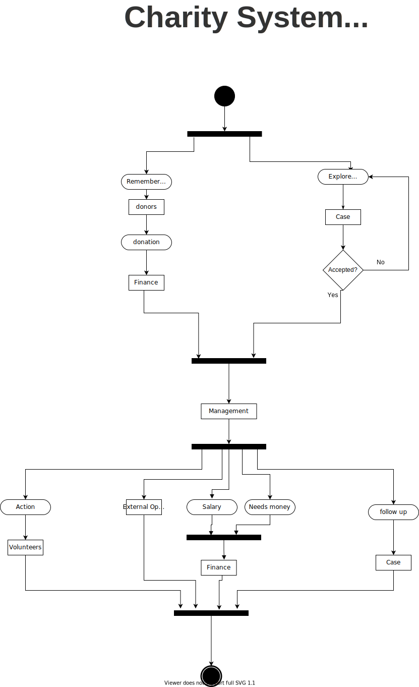
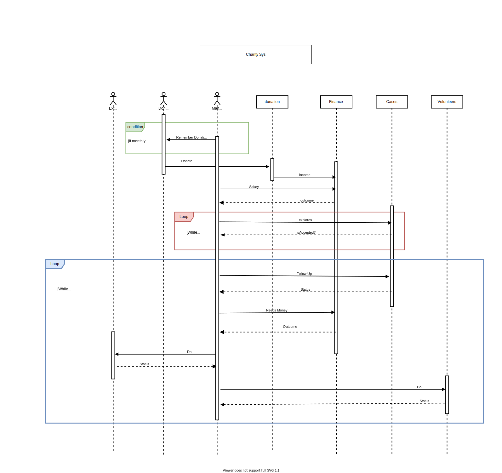

# Software Engineering
Prof. Amr Thabet 
Assist. Lec. Shimaa Hagras 
   
# Charity System Analysis  

  

## Intro:  
We all have volunteered someday. As volunteers, we saw that the regular systematic management system of charities devours a lot of time and effort. As a Software Engineering student, we tried to analyze charities' management systems. In the future, we plan to make a fully automated system. We Know that a charity is a gigantic system that has a lot of departments, operations, and people. All these components interact with each other in a very complicated way. So, we made a lot of constraints and tried to minimize the system to its core working blocks as this is V1.0 of this analysis. We also plan to extend this analysis when our experience gets more powerful.

   

## Description: 
A system that handles the operations inside a charity, going from the management head to the employees, and handling the donations and volunteering process to benefit the cases it observes and/or explores. It handles (the finances between the management and employees), (logistics requesting funds), and (logistics exploring to find new rightful cases to help). It also handles the status of the cases that have already been helped to make sure that these cases get the attention they need.
   

## User documentation:
I. End-users: 
a. Volunteers 
b. Donors 
c. Cases  
II. Admin users: 
a. Management 
  

## Our system building blocks: 
• Donors: people who donate money or any other thing. they may set a date
for a monthly donation. 
• Volunteers: who works under the auspices of management. 
• Management: paid or not. they are almost in charge of all things. 
• Cases: any situation that charity can help with. It can by a mankind, mosque
or a whole village. 
• Logistics: almost anything management do. 
• Finance: in charge of handling all resources. 
  
## Our Analysis Constrains:
AS we previously mentioned, we have made a lot of constrains,
ignored a lot of department and operations, and merged a lot of roles and
departments. In this section we will give examples of this constrains. 
 
Ignored Departments:  
• HR  
• PR  
• Media  
• Partnerships  
Some of our Constrains:  
• Management does exploration.  
• Management may have no salary.  
• Age and gender may be null.  
  
## Process of finding cases and helping them: 
• Firstly, the management needs to find a case that matches the criteria of
cases that would require help.  
• Secondly, the management sends back the information of the to handle
the scouting process to see if the case is eligible for the charities' efforts of
helping.  
• Thirdly, If the case is eligible (under the standard criteria), the
management department approves the process of help, hence, requesting
the material it would need to start helping (money, food, clothes, etc...)
from the finances department.  
• Fourthly, the management starts gathering supplies that were requested
in the logistics operations, then starts to assess the man-power it needs to
start gathering volunteers that are willing to help from the department
assigned to that specific case.  
• Finally, a team consists of managements (Multiple*) and volunteers are
assigned to this case with a date and time to start the final step of the
process, coming back with a status of the case after helping, let that be
(NEEDS FURTHER ATTENTION, NEEDS CHECKUP EVERY (time), CLOSED).  

  

## Class Diagram: 

   

## Use Case Diagram: 

   

## Activity Diagram: 

   

## Sequence Diagram: 
 

   

## Risk Analysis: 
 
Types of predicted Risks: 
1.	Strategic. 
2.	Operational. 
3.	Hazard. 
4.	Financial. 
5.	Technical.  
Available Solutions: 
1.	Avoid: eliminate cause of risk. 
2.	Mitigate: reduce probability or impact of risk. 
3.	Accept: continency plans for risk. 
4.	Transfer: have third party take on responsibility for risk.  

Risks:

   

## Contributors:  
Ahmed Yasser Fathi Othman 
Moaz Mohammed Samy  
      

