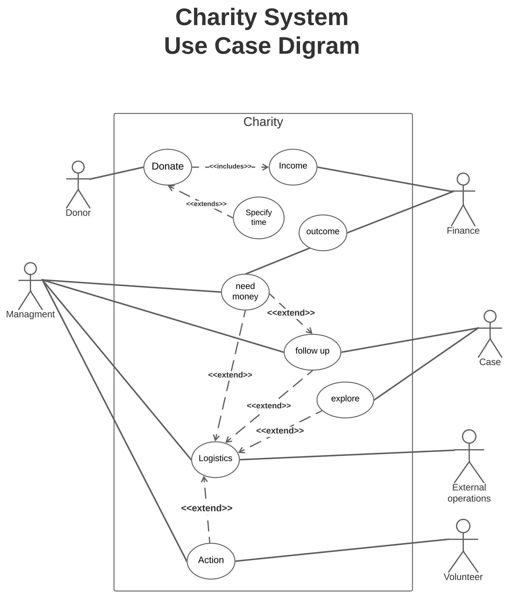

# Charity System Analysis  

## Intro
We All have volunteered someday. As volunteers, we saw that the regular systematic management system of charities devours a lot of time and effort.
As a Software Engineering student, we tried to analyze charities' management systems. In the future, we plan to make a fully automated system.
We Know that a charity is a gigantic system that has a lot of departments, operations, and people. All these components interact with each other in a very complicated way. So, we made a lot of constraints and tried to minimize the system to its core working blocks as this is V1.0 of this analysis. We also plan to extend this analysis as our experience gets more powerful.

   

   

   

